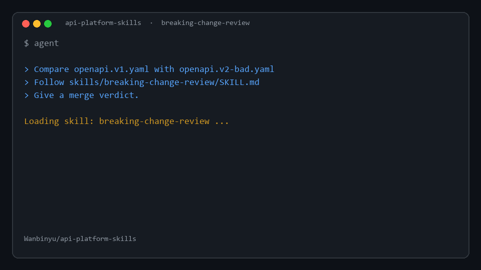
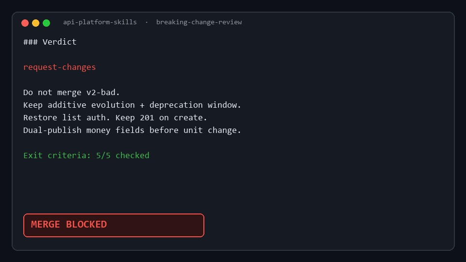

# API Platform Skills

**English** | [中文](README.zh-CN.md)


<p align="center">
  <strong>Design is easy. Evolution is hard.</strong>
</p>

<p align="center">
  Agent skills that make coding agents review API <em>contracts like a platform team</em><br/>
  — not invent another REST naming guide.
</p>

<p align="center">
  <a href="https://github.com/Wanbinyu/api-platform-skills/blob/main/LICENSE"></a>
  <a href="https://github.com/agentskills/agentskills"></a>
  <a href="https://github.com/Wanbinyu/api-platform-skills/releases"></a>
  
</p>

<p align="center">
  <a href="#install">Install</a> ·
  <a href="#skills">Skills</a> ·
  <a href="#30-second-demo">Demo</a> ·
  <a href="#why-this-exists">Why this</a> ·
  <a href="docs/NOT-ANOTHER-API-DESIGN-PACK.md">vs others</a> ·
  <a href="docs/SOCIAL.md">share copy</a>
</p>

<p align="center">
  
</p>

<p align="center"><sub>Demo: agent loads <code>breaking-change-review</code> on a bad v1→v2 OpenAPI diff → <strong>MERGE BLOCKED</strong></sub></p>

---

## Sister pack

| Pack | Surface |
|------|---------|
| **api-platform-skills** (this) | HTTP / OpenAPI for humans & SDKs |
| [ai-surface-skills](https://github.com/Wanbinyu/ai-surface-skills) | Tools / MCP for **agents** |

Compose both: evolve HTTP with this pack; evolve agent tool contracts with ai-surface-skills.

---

## What you get

Install once. Your agent learns **ten workflows** for the hard part of HTTP APIs:

| When your agent is… | It should run… |
|---------------------|----------------|
| Adding endpoints from a blank page | **Contract-first OpenAPI** gates |
| Changing a field on a live API | **Breaking-change review** + **compat matrix** |
| Removing v1 after v2 ships | **Deprecation playbook** |
| Designing `POST /payments` | **Idempotency & retries** |
| Pushing events to customers | **Webhook design** |
| Reviewing public routes for abuse | **Secure API surface** (product APIs) |
| Writing partner release notes | **API changelog** |

Each skill ships with:

- clear **triggers** (when to load)
- numbered **steps**
- hard **exit criteria** (done ≠ “sounds good”)
- fixed **report templates**
- explicit **anti-patterns** agents usually invent

---

## Why this exists

Most skill packs stop at **shape**:

> plural nouns · status codes · pagination · “use OpenAPI”

That’s useful — and already covered well by community packs  
([addyosmani/agent-skills](https://github.com/addyosmani/agent-skills) `api-and-interface-design`, ECC `api-design`, wshobson backend skills, etc.).

**This pack starts where those stop: the platform layer.**

```text
┌─────────────────────────────────────────────────────────┐
│  Shape layer (use other packs)                          │
│  resource design · HTTP semantics · style guides        │
└───────────────────────────┬─────────────────────────────┘
                            │
                            ▼
┌─────────────────────────────────────────────────────────┐
│  Evolution layer  ←  api-platform-skills                │
│  compatibility · breaking changes · deprecation         │
│  CDC · idempotency · webhooks · API surface security    │
└─────────────────────────────────────────────────────────┘
```

They compose. They don’t compete. Details: **[docs/NOT-ANOTHER-API-DESIGN-PACK.md](docs/NOT-ANOTHER-API-DESIGN-PACK.md)**.

---

## Install

### Claude Code（推荐，直接进 Skills）

Skills 已是标准 **`SKILL.md`**，装进 Claude 后可自动按描述触发。

**一键装到本机 Claude（全局）：**

```powershell
# Windows
git clone https://github.com/Wanbinyu/api-platform-skills.git
cd api-platform-skills
.\scripts\install.ps1 -Claude
# 默认不带参数也是装 Claude：.\scripts\install.ps1
```

```bash
# macOS / Linux
git clone https://github.com/Wanbinyu/api-platform-skills.git
cd api-platform-skills
chmod +x scripts/install.sh
./scripts/install.sh --claude
```

写入：`~/.claude/skills/<name>/SKILL.md` → **重启 Claude Code 会话**。

**Claude Code Plugin / Marketplace：**

```text
/plugin marketplace add Wanbinyu/api-platform-skills
/plugin install api-platform-skills@api-platform-skills
/reload-plugins
```

**当前项目 only：**

```powershell
.\scripts\install.ps1 -Project   # → .claude/skills/ 等
```

完整说明（验证、排错、网页版）：**[docs/CLAUDE.md](docs/CLAUDE.md)**

### 其他 Agent

```powershell
.\scripts\install.ps1 -All       # Claude + Codex(~/.agents) + Cursor
```

| Agent | Directory |
|-------|-----------|
| Claude Code | `~/.claude/skills/` or `.claude/skills/` |
| Codex / open standard | `~/.agents/skills/` or `.agents/skills/` |
| Cursor | `~/.cursor/skills/` or `.cursor/skills/` |
| GitHub Copilot | `.github/skills/` |

Keep folder names unchanged. Each skill is `skills/<name>/SKILL.md`.

---

## Skills

### Lifecycle map

```text
  define contract          ship change              run reliably
 ───────────────     ─────────────────────     ──────────────────
 contract-first   →  compat-matrix             idempotency
                     breaking-change-review    webhook-design
                     deprecation-playbook      secure-api-surface
                     consumer-driven-contract
                              │
                              ▼
                     api-changelog  (tell consumers)
                              │
                              ▼
                     /api-ship-check  (gate them in order)
```

### Catalog

| # | Skill | One-line job |
|---|--------|--------------|
| 0 | [`using-api-platform-skills`](skills/using-api-platform-skills/SKILL.md) | Router — pick the smallest right skill |
| 1 | [`contract-first-openapi`](skills/contract-first-openapi/SKILL.md) | Spec + review gate **before** handlers |
| 2 | [`compatibility-matrix`](skills/compatibility-matrix/SKILL.md) | Delta × consumer blast radius |
| 3 | [`breaking-change-review`](skills/breaking-change-review/SKILL.md) | PR verdict + migration notes |
| 4 | [`deprecation-playbook`](skills/deprecation-playbook/SKILL.md) | Announce → dual-track → sunset |
| 5 | [`consumer-driven-contract`](skills/consumer-driven-contract/SKILL.md) | Consumer expectations → CI gates |
| 6 | [`idempotency-and-retries`](skills/idempotency-and-retries/SKILL.md) | Keys, storage, safe retries |
| 7 | [`webhook-design`](skills/webhook-design/SKILL.md) | Sign, replay, at-least-once |
| 8 | [`secure-api-surface`](skills/secure-api-surface/SKILL.md) | BOLA/BFLA, oversharing, mass-assignment |
| 9 | [`api-changelog`](skills/api-changelog/SKILL.md) | Consumer-facing release notes from diffs |

### Natural language triggers

You don’t need slash commands. Say things like:

- *“Review this PR for breaking API changes.”*
- *“Build a deprecation plan for `/v1/orders`.”*
- *“Make `POST /payments` idempotent under client retries.”*
- *“Ship-check this OpenAPI diff before merge.”*

Optional command stubs live in [`commands/`](commands/) for harnesses that support them (`/api-break`, `/api-ship-check`, …).

---

## 30-second demo

<p align="center">
  
</p>

### Fixtures

| Scenario | Files | Expected |
|----------|-------|----------|
| Orders (classic break demo) | [`examples/toy-orders-api/`](examples/toy-orders-api/) | **request-changes** |
| Billing safe additive | [`examples/billing-api/`](examples/billing-api/) `v1` → `v1.1-safe` | **approve** |
| Billing risky cleanup | `v1` → `v2-risky` | **request-changes** |

Golden reports live under [`examples/sample-reports/`](examples/sample-reports/).

### Machine assist (OpenAPI diff)

```bash
# from repo root — structural deltas for the agent
python scripts/openapi_breaking_diff.py \
  examples/billing-api/openapi.v1.yaml \
  examples/billing-api/openapi.v2-risky.yaml

# exit 0 = no hard breaks; exit 2 = hard/semantic breaks found
```

Agent still owns migration notes and final merge verdict (`breaking-change-review`).

### Prompt

```text
Compare examples/toy-orders-api/openapi.v1.yaml with openapi.v2-bad.yaml.
Optionally run scripts/openapi_breaking_diff.py first.
Follow skills/breaking-change-review/SKILL.md. Merge verdict required.
```

### Share / star

Ready-to-post copy (EN + 中文): **[docs/SOCIAL.md](docs/SOCIAL.md)**

---

## Quality bar (how we avoid “prompt lore”)

Every skill in this repo must include:

1. YAML `name` + trigger-rich `description`
2. Numbered workflow
3. **Exit criteria** (checkboxes)
4. Anti-patterns
5. Copy-paste **output template**

If a skill can’t fail a checklist, it doesn’t ship. See [CONTRIBUTING.md](CONTRIBUTING.md).

---

## Roadmap

| Version | Focus |
|---------|--------|
| **0.1** | Nine skills · toy OpenAPI · installers · golden report |
| **0.1.1** | Claude-native install · bilingual triggers · skill validator CI |
| **0.1.2** | Billing fixtures · sample reports · `openapi_breaking_diff.py` |
| **0.1.3** | `api-changelog` skill · param-aware OpenAPI diff |
| **0.2** | More real-world samples · eval harness |
| **0.3** | Lightweight eval fixtures (agent with/without skill) |
| **0.4** | Optional gRPC / GraphQL evolution add-ons |

---

## Contributing · License · Author

- **Contribute:** [CONTRIBUTING.md](CONTRIBUTING.md)
- **License:** [MIT](LICENSE) — free to use, fork, and ship in commercial products
- **Author:** [Wanbinyu](https://github.com/Wanbinyu)

```text
MIT · open source · https://github.com/Wanbinyu/api-platform-skills
```

---

## One skill = one project (optional)

Prefer installing a **single skill**? Each skill is also exported as a standalone project under `G:\skill\solo\<name>` and can be published as `skill-<name>` on GitHub.

- Local catalog: `G:\skill\solo\CATALOG.md` / `G:\skill\SOLO-MODEL.md`
- Bulk install: this collection repo (all skills at once)

